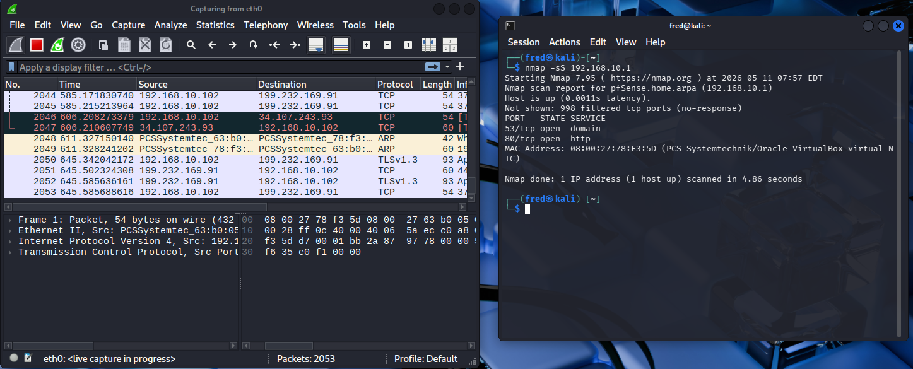
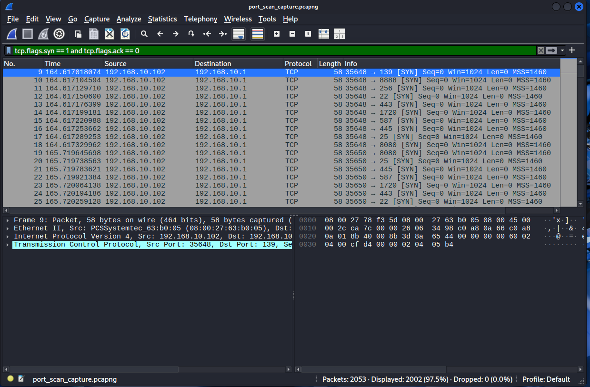
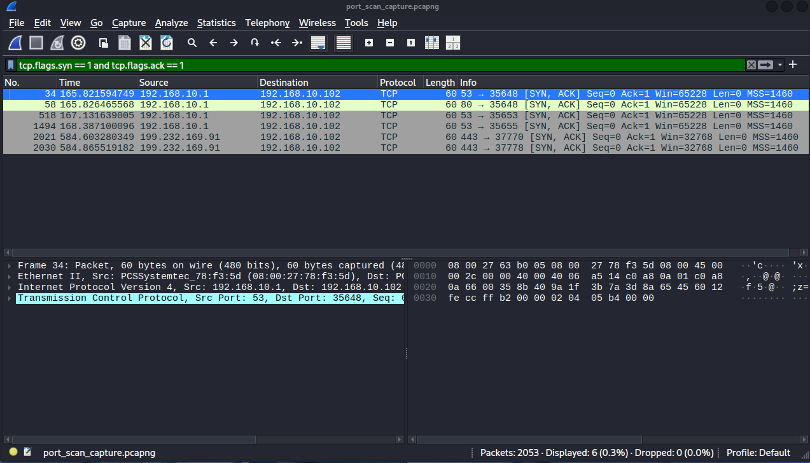
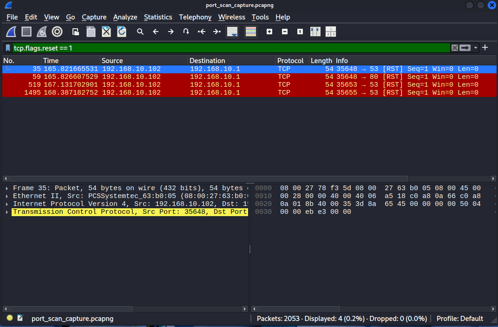
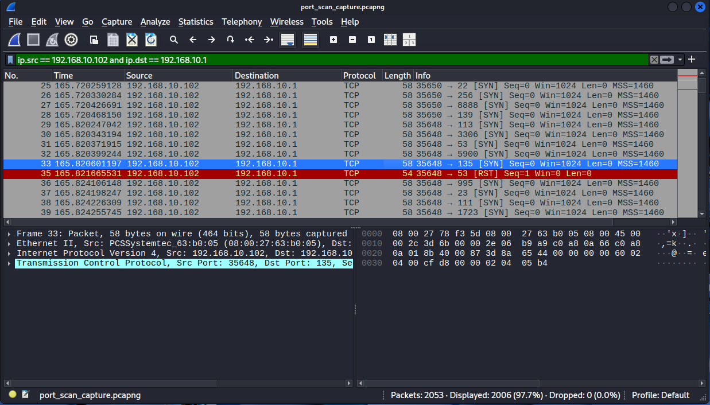
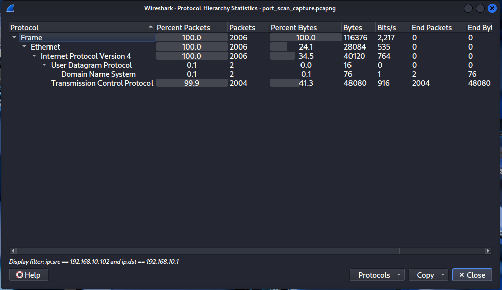

# 🌐 Network Traffic Analysis Using Wireshark
## Port Scan Detection and Network Reconnaissance Analysis

---

## 📌 Problem
Attackers perform network reconnaissance before 
launching attacks, which means scanning for open ports to 
find vulnerable services. This project captures 
and analyzes real port scan traffic using Wireshark 
to identify reconnaissance activity.

---

## 🎯 Objectives
- Generate real port scan traffic using Nmap
- Capture live network traffic using Wireshark
- Apply display filters to isolate scan patterns
- Identify open ports and suspicious traffic behaviour
- Analyze protocol hierarchy for anomaly indicators

---

## 🛠️ Tools Used
| Tool | Purpose |
|---|---|
| **Wireshark** | Network packet capture and analysis |
| **Nmap** | Port scanning and network reconnaissance |
| **Kali Linux** | Security testing environment |
| **TCP/IP** | Network protocol analyzed |

---

## 🧠 Attack Background

### What is a Port Scan?
Before attacking a system, attackers scan it to 
find open ports. Open ports are services that are actively 
listening for connections.
### SYN Scan (-sS) Explained
Nmap's SYN scan is a stealthy reconnaissance technique:

Step 1: Attacker → Target   SYN      "Is this port open?"

Step 2: Target   → Attacker SYN-ACK  "Yes, I'm open!"

Step 3: Attacker → Target   RST      "Thanks, goodbye"

The connection is never fully established, thereby making 
it faster and harder to detect than a full connect scan.

---

## 🔬 Methodology

### Step 1 — Start Wireshark Capture
Started capturing on eth0 interface to record 
all network traffic in real time.

### Step 2 — Run Nmap SYN Scan
nmap -sS 192.168.10.1
Scanned 1000 ports on the gateway IP while 
Wireshark recorded all traffic.

### Step 3 — Apply Display Filters
Used Wireshark filters to isolate and analyze 
specific traffic patterns.

### Step 4 — Analyze Protocol Hierarchy
Used Statistics → Protocol Hierarchy to identify 
suspicious traffic imbalances.

---

## 🔎 Wireshark Filters Used

### Filter 1 — Isolate SYN Packets (The Scan)
tcp.flags.syn == 1 and tcp.flags.ack == 0
Shows only outgoing SYN packets — the port scan itself.

### Filter 2 — Find Open Ports (SYN-ACK Responses)
tcp.flags.syn == 1 and tcp.flags.ack == 1
Shows ports that responded — confirming they are open.

### Filter 3 — RST Packets (Connection Teardown)
tcp.flags.reset == 1
Shows RST packets Nmap sent after confirming 
open ports — characteristic of SYN scan behaviour.

### Filter 4 — Complete Scan Traffic
ip.src == 192.168.10.102 and ip.dst == 192.168.10.1
Shows all traffic between scanner and target.

---

## 📸 Results

### Nmap Scan Results + Wireshark Capture

### Filter 1 — SYN Packets

### Filter 2 — Open Ports

### Filter 3 — RST Packets

### Filter 4 — Full Scan Traffic

### Protocol Hierarchy

---

## 🧠 Analysis

### Finding 1 — Port Scan Confirmed
2002 SYN packets were sent from 192.168.10.102 
to 192.168.10.1 in under 5 seconds. This speed 
is consistent with automated port scanning — 
no human can manually send 2000 packets in 5 seconds.

### Finding 2 — Open Ports Discovered
6 SYN-ACK responses confirmed open ports:

| Port | Service | Risk |
|---|---|---|
| 53 | DNS | Medium — DNS attacks possible |
| 80 | HTTP | High — web admin panel exposed |

### Finding 3 — SYN Scan Technique Identified
RST packets sent immediately after SYN-ACK 
responses confirm this was a SYN scan — a 
stealthy reconnaissance technique that avoids 
completing the full TCP handshake.

### Finding 4 — Protocol Anomaly
Protocol hierarchy showed 99.9% TCP traffic, this indicates a clear anomaly. Normal network traffic has a 
balanced mix of protocols. This extreme TCP 
dominance is a strong indicator of port scanning.

### Finding 5 — Reconnaissance Intent
The combination of systematic port scanning, 
SYN scan technique, and service discovery 
confirms this was deliberate network reconnaissance 
— the first step of a potential attack.

---

## ⚠️ What an Attacker Would Do Next

After discovering open ports an attacker would:

| Open Port | Likely Next Step |
|---|---|
| Port 80 (HTTP) | Visit the web page — look for admin login panel |
| Port 53 (DNS) | Attempt DNS zone transfer or DNS poisoning |

---

## ✅ Conclusion & Recommendations

### What Was Detected
A full SYN port scan was performed against the 
gateway IP, discovering 2 open ports out of 1000 
scanned. The attack pattern was confirmed through 
Wireshark packet analysis and protocol hierarchy 
statistics.

### Recommendations
| Recommendation | Purpose |
|---|---|
| Block port 80 externally | Prevent web admin panel exposure |
| Implement IDS/IPS | Automatically detect port scan patterns |
| Enable firewall logging | Record all connection attempts |
| Monitor for SYN floods | Detect aggressive scanning activity |
| Restrict DNS zone transfers | Prevent DNS reconnaissance |

---

## 🔗 Related Projects
- [Brute Force Detection](https://github.com/Phredreeq/brute-force-detection)
- [Password Spray Detection](https://github.com/Phredreeq/password-spray-detection)
- [Incident Investigation Report](https://github.com/Phredreeq/incident-investigation-report)
- [ML Anomaly Detection](https://github.com/Phredreeq/anomaly-detection-login-behaviour)

---

## 👤 Author
Fredrick Agufenwa
Cybersecurity Student | SOC & Threat Detection
